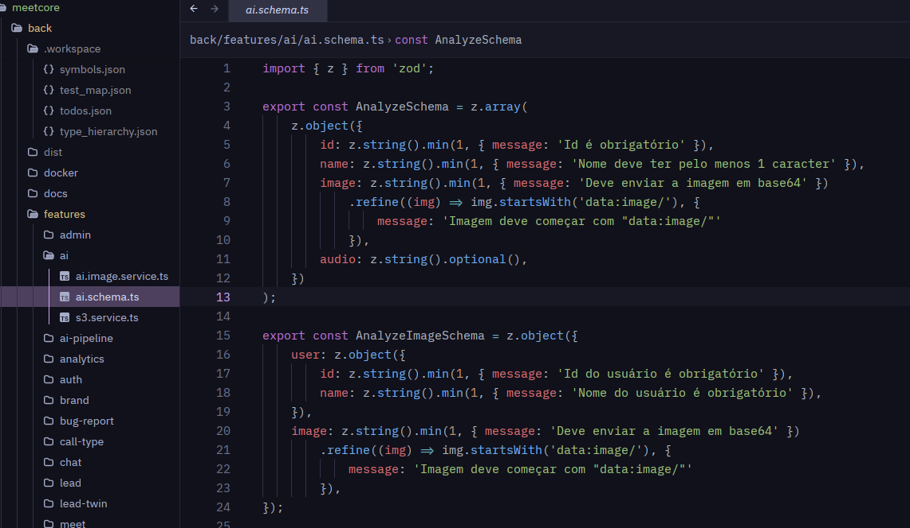

<div align="center">

# Sousa Nebula

### A quiet, dark-purple theme for Zed

[](https://zed.dev)
[](./extension.toml)
[](https://zed.dev/schema/themes/v0.2.0.json)

Frosted dark surfaces, restrained borders, soft contrast, and a focused purple accent—designed to match the Sousa Nebula terminal palette without distracting from the code.

<br>



</div>

## Highlights

- Deep `#11111b` editor background with layered surfaces.
- Native blurred-window appearance with carefully tuned transparency.
- Subtle borders that blend naturally into the interface.
- Purple focus states using `#cba6f7` and muted variants.
- Cohesive colors across tabs, panels, menus, scrollbars, and the terminal.
- Carefully balanced line numbers, indentation guides, and active-line states.
- Syntax colors for common language constructs and semantic states.
- Complete ANSI terminal palette included in the theme.
- Distinct cursors and selections for collaborative editing.

## Palette

| Role | Color | Preview |
| --- | --- | --- |
| Background | `#11111b` |  |
| Surface | `#181825` |  |
| Elevated surface | `#1e1e2e` |  |
| Subtle border | `#252536` |  |
| Foreground | `#cdd6f4` |  |
| Muted text | `#a6adc8` |  |
| Purple accent | `#cba6f7` |  |

## Installation

Sousa Nebula can currently be installed as a development extension.

1. Clone the repository:

   ```bash
   git clone https://github.com/JohnnyBoySou/zed-theme.git
   ```

2. Open the Zed command palette:

   - Linux/Windows: `Ctrl+Shift+P`
   - macOS: `Cmd+Shift+P`

3. Run `zed: install dev extension`.
4. Select the cloned `zed-theme` directory.
5. Open the theme selector and choose **Sousa Nebula**:

   - Linux/Windows: `Ctrl+K`, then `Ctrl+T`
   - macOS: `Cmd+K`, then `Cmd+T`

Zed automatically reloads the theme while its files are being edited.

> [!NOTE]
> Blur depends on window-system and compositor support. On unsupported environments, the translucent surfaces may appear without background blur.

## Project structure

```text
zed-theme/
├── extension.toml
├── README.md
└── themes/
    └── sousa-nebula.json
```

The extension manifest lives in [`extension.toml`](./extension.toml), while all interface, syntax, and terminal colors are defined in [`themes/sousa-nebula.json`](./themes/sousa-nebula.json).

## Development

After installing the repository as a development extension, edit the theme JSON and preview changes directly in Zed.

Validate the JSON syntax with:

```bash
jq empty themes/sousa-nebula.json
```

The theme targets the official [Zed theme schema v0.2.0](https://zed.dev/schema/themes/v0.2.0.json).

## Contributing

Issues and pull requests are welcome. When proposing a color change, please consider readability, contrast, and consistency across the editor, panels, and integrated terminal.
